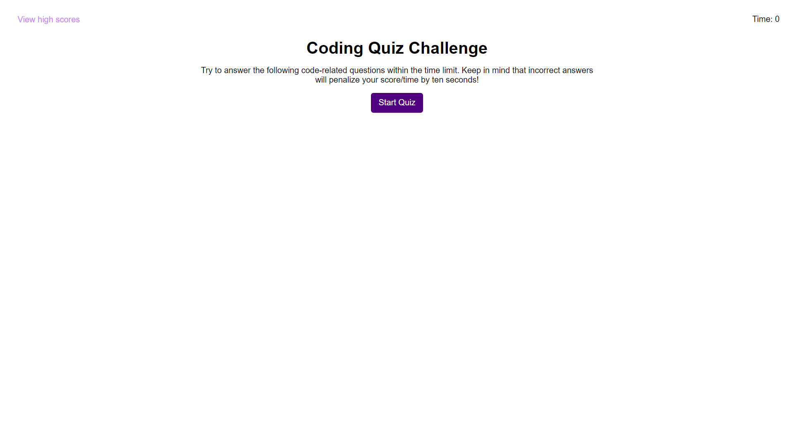

# Coding Quiz!

## Purpose
This is a rather easy coding quiz that gives you a few JavaScript-related questions that have to be answered before the timer runs out. Once the quiz is finished, your final score is how much time you had remaining, which can be submitted and saved to localStorage.

## Website
https://jec6789.github.io/coding-quiz/

## Known Issues
On the view high scores screen, the listed scores are not sorted by how high they are. If my previous C++ experience is any indication, this could be fixed by implementing some kind of sorting algorithm. However, I barely understood how those things worked in C++, and I don't yet have the experience to implement such a thing in JavaScript.

## Contributors
Made with ❤️ by JEC6789